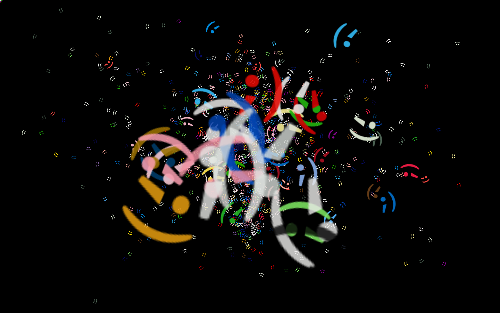

point line 67 of testApp.cpp to this file:
https://github.com/donundeen/objectcrowdsourcer/blob/master/taggedMin.json

also note that there's a symlink in the data folder to imageCache_480 in the project...

